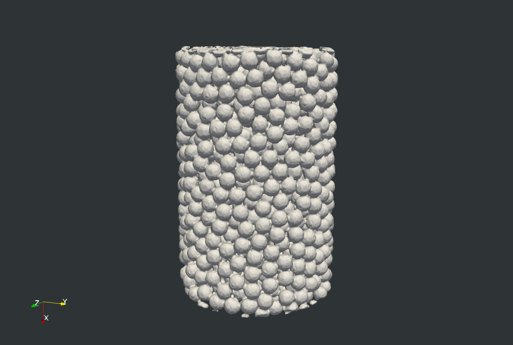
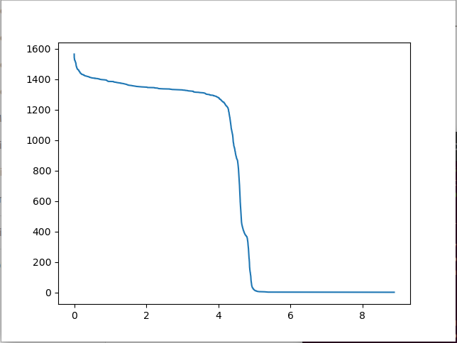
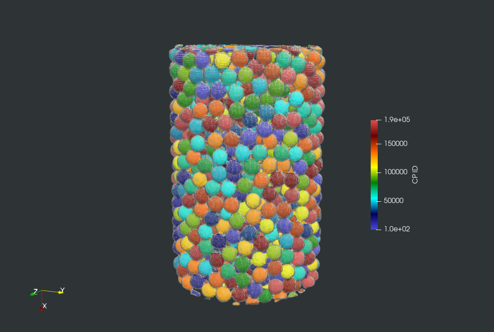
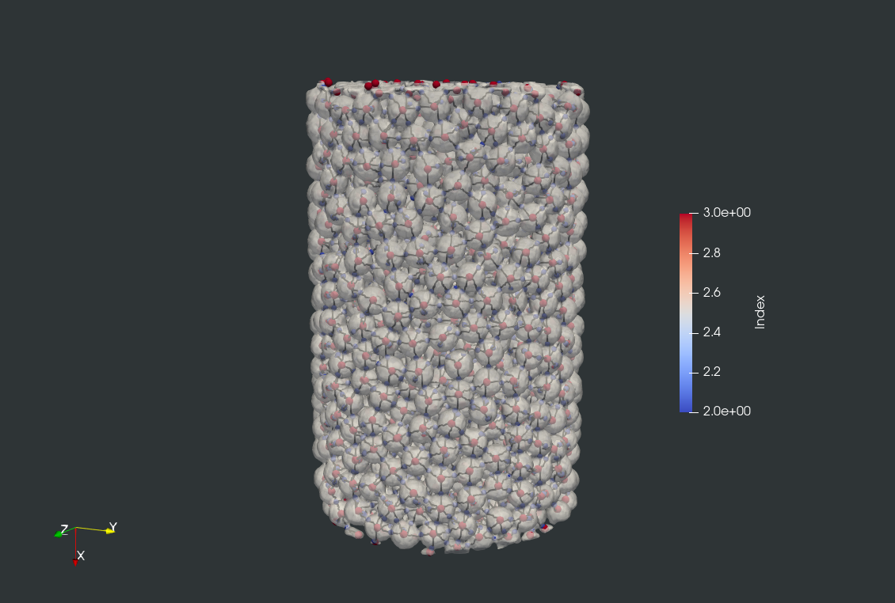

# MorseGram #


This repository contains code to compute a discrete Morse theory based segmentation of three dimensional X-ray computed tomography data of granular/discrete material systems. It also includes MorseGramVis, a tool that supports visualization and analysis of the segmentation and contact network produced by MorseGram. The code is based on the method described in the paper: 

Karran Pandey, Talha Bin Masood, Saurabh Singh, Ingrid Hotz, Vijay Natarajan, and Tejas G. Murthy.  
Morse theory-based segmentation and fabric quantification of granular materials.  
Granular Matter, 24(1), 2022, 27:1-20.  
https://doi.org/10.1007/s10035-021-01182-7  
[[Springer Link]](https://link.springer.com/article/10.1007/s10035-021-01182-7)    

Please cite this publication if you use this method or the library in your work:

@article{pandey2022morse,  
  title={Morse theory-based segmentation and fabric quantification of granular materials},  
  author={Pandey, Karran and Bin Masood, Talha and Singh, Saurabh and Hotz, Ingrid and Natarajan, Vijay and Murthy, Tejas G},  
  journal={Granular Matter},  
  volume={24},  
  number={1},  
  pages={27},  
  year={2022},  
  doi = {https://doi.org/10.1007/s10035-021-01182-7},  
  publisher={Springer}  
}

An earlier version of this repository which was used to obtain the results in the paper can also be found [here](https://github.com/karran13/Granular-Material-Packing-Analysis).

# Dependencies

## Installing PyMS3D

This implementation depends extensively on the [PyMS3D python package](https://github.com/vgl-iisc/mscomplex3d), which must be installed in your python environment prior to running the pipeline. Please follow the steps under the "Building and Installing" section in [the readme file](https://github.com/vgl-iisc/mscomplex3d/blob/main/Readme.md).

## Installing Python Dependencies

The `requirements.txt` file contains a summary of all required dependencies. With your PyMS3D python environment active, run the following command:

```bash
$ pip install -r requirements.txt
```

If everything installs correctly, you should be ready to run the pipeline.

# Running the Pipeline

All the pipeline scripts are contained within the `python routines` directory, so the rest of this document assumes your terminal's working directory to be set there.

## Dataset

The test dataset, located in the 'Test Data' folder in the repository, is an mhd file of the CT scan of a spherical bead packing. When visualized, the scan looks as follows:


## Creating the Distance Field

`distance_field.py` takes as input the raw CT image (multiple formats are to be supported, currently '.mat' ,'.raw' formats are supported) and outputs the distance field based on the extracted boundary. To run the script, execute the following command in the terminal:

`python distance_field.py [Path to mat/raw data file] [downscaling factor]`

eg :


This will store the computed distance field in MetaImage format (.mhd + .raw) in the 'ChamferDistance' folder in the repository. Also a raw data file (.mhd + .raw) is stored in the raw data folder. When visualized in ParaView, the isosurface with isovalue 0 looks as follows:



Once you have obtained the distance field, the rest of the pipeline can be run in either **auto** or **manual** mode.

## Auto Mode

The program allows for the automatic computation of the segmentation, connectivity network and contact regions. To run the program in auto mode, execute the following command:

`python main.py --mode auto [Path to .raw file of distance field]`

## Manual Mode

`main.py` is the entrypoint for running the Morse-Smale Complex computation
and extracting relevant geometric and topological structures for analysis. It
takes the computed distance field (in .raw format) as input and returns the structures selected from the in-program menu. The program allows for the visualization of the persistence curve, computation/simplification of the MS-Complex and extraction of the segmentation, connectivity network and contact regions in the granular material packing.

`python main.py [Path to .raw file of distance field]`

eg:


The program will display the following menu:


> ⚠️ Note: Most of the steps of the pipeline depend upon the previous ones, so they must be run in order.

Running this will store the selected structures in '.mhd' or '.vtp' format (accessible through VTK/ParaView) in the 'Outputs' folder in the repository.

Few notes here: Use the 'knee' in the persistence curve to select a simplification threshold.



We identify the precise persistence value for the knee, by hovering the cursor over the graph at the location of the knee and seeing the displayed x-co-ordinate in the persistence curve window. In this case, it turns out to be 0.2.

We then use the other options to store the outputs for the segmentation and connectivity network.

These files, along with information about the grain centres, contact regions and points will be stored in the outputs folder. When visualized, the segmentation, network, contacts and grain centres will look as follows:

Segmentation:



Connectivity Network:



---

# Copyright

Copyright (c) 2021 Visualization & Graphics Lab (VGL), Indian Institute of Science. All rights reserved.

Redistribution and use in source and binary forms, with or without
modification, are permitted provided that the following conditions are met:

1. Redistributions of source code must retain the above copyright notice, this list of conditions and the following disclaimer.
2. Redistributions in binary form must reproduce the above copyright notice, this list of conditions and the following disclaimer in the documentation and/or other materials provided with the distribution.

THIS SOFTWARE IS PROVIDED BY THE COPYRIGHT HOLDERS AND CONTRIBUTORS "AS IS" AND
ANY EXPRESS OR IMPLIED WARRANTIES, INCLUDING, BUT NOT LIMITED TO, THE IMPLIED
WARRANTIES OF MERCHANTABILITY AND FITNESS FOR A PARTICULAR PURPOSE ARE
DISCLAIMED. IN NO EVENT SHALL THE COPYRIGHT OWNER OR CONTRIBUTORS BE LIABLE FOR
ANY DIRECT, INDIRECT, INCIDENTAL, SPECIAL, EXEMPLARY, OR CONSEQUENTIAL DAMAGES
(INCLUDING, BUT NOT LIMITED TO, PROCUREMENT OF SUBSTITUTE GOODS OR SERVICES;
LOSS OF USE, DATA, OR PROFITS; OR BUSINESS INTERRUPTION) HOWEVER CAUSED AND
ON ANY THEORY OF LIABILITY, WHETHER IN CONTRACT, STRICT LIABILITY, OR TORT
(INCLUDING NEGLIGENCE OR OTHERWISE) ARISING IN ANY WAY OUT OF THE USE OF THIS
SOFTWARE, EVEN IF ADVISED OF THE POSSIBILITY OF SUCH DAMAGE.
 
Authors   : Karran Pandey, Saurabh Singh, Dinesh Rathod

Contact  : karran13@gmail.com , saurabhsingh@alum.iisc.ac.in, rathoddinesh@iisc.ac.in


---
