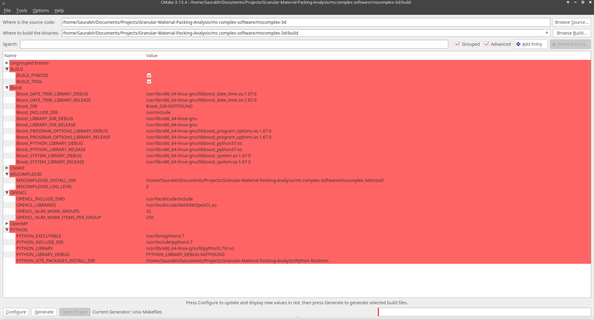

# Segmentation of X-ray CT sand data using Morse complex

## Description

This repository contains the code for discrete Morse theory based segmentation
of three dimensional X-ray computed tomography data of (cemented)
granular/discrete material systems.

e-mail: karran13@gmail.com

e-mail: saurabhsingh@alum.iisc.ac.in

---
## Requirements

To compile and execute this code, you will need Cmake > 3.1.8, Boost > 1.58,
OpenCL 1.1 (implicitly available along with CUDA > 10.1), OpenMP and python
with the following packages:

1. vtk
2. scikit-image
3. SimpleITK
4. ITK
5. numpy/scipy
6. numba

---

## Instructions

### Prerequisite installation

* Install Cmake, Boost using your software package manager
* If your gpu is Cuda compatible, follow the detailed installation instructions [here](https://docs.nvidia.com/cuda/cuda-installation-guide-linux/index.html). Or install opencl from your software package manager. Check if opencl is working with clinfo. If you get "number of platform 0", it means opencl is not working correctly. Fix the installation of opencl.
* OpenMP should be normally installed if not use your package manager to install openmp libraries.
* Install python packages, specifically numpy as it will be used for building the pyms3d module.
* Install cmake-gui for building pyms3d.

### Installing pyms3d

The MS-Complex computation is done using pyms3d. The installation
instruction of pyms3d are as follows:

* Clone the repository

```sh
git clone repository_address
```

* Navigate to mscomplex-3d, create build and install directories

 ```sh
 cd bead-network-computation/ms\ complex\ software/mscomplex-3d/
 mkdir build install
 cd build
 ```

* Build pyms3d using cmake-gui

 ```sh
 cmake-gui
 ```

  1. In the cmake-gui, provide the path for
      - source code ---> absolute path to mscomplex-3d
      - build directory ---> absolute path to mscomplex-3d/build
  2. Press configure to see the default values cmake-gui picked up
  3. Use advance option and change the default values to something similar to the following

   

  4. Important:

    - Check BUILD_PYMS3D, BUILD_TOOL.
    - Press configure to update and display new values.
    - Provide path for MSCOMPLEX3D_INSTALL_DIR, opencl cuda paths, libboost paths, python3 paths.
    - The path to PYTHON_SITE_PACKAGE_DIR should be "Python Routines" in the repository folder.
    - Click generate and close cmake-gui.

* From the build directory, execute the following commands:

    ```sh
    make -j8
    make -j8 install
    ```

   Where 8 is number of processes used to build the pyms3d.

* If everything went alright, you should see 'pyms3d.so' in 'Python Routines' directory.
* To check whether your installation works, import pyms3d in ipython or jupyter-lab. If import is successful, your installation works.

### Running the Pipeline

The python scripts to run the pipeline can be found in the Python Routines folder. You should have all the python packages specified above to run the pipeline successfully. The scripts and their input formats are described below:

#### distance_field.py

This script takes as input the raw CT image (multiple formats are to be supported, currently '.mat') and outputs the distance field based on the extracted boundary. To run the script, execute the following command in the terminal:

`python distace_field.py [Path to raw data file] [downscaling factor]`

This will store the computed distance field in MetaImage format (.mhd + .raw) in the 'ChamferDistance' folder in the repository. Also a raw data file (.mhd + .raw) is stored in the raw data folder.

#### main.py

This script is the main interface to run the Morse-Smale Complex computation
and extract relevant geometric and topological structures for analysis. It
takes the computed distance field (in .raw format) as input and returns the structures selected from the in-program menu. The program allows for the visualization of the persistence curve, computation/simplification of the MS-Complex and extraction of the segmentation, connectivity network and contact regions in the granular material packing.

`python main.py [Path to .raw file of distance field]`

Running this will store the selected structures in '.mhd' or '.vtp' format (accessible through VTK/ParaView) in the 'Outputs' folder in the repository.

Few notes here: Use the 'knee' in the persistence curve to select a simplification threshold.

## References

For more information about the method, refer to the follwoing paper. Please cite these publications if you use this method or the library in your work.


Morse theory-based segmentation and fabric quantification of granular materials 

Pandey, K., Bin Masood, T., Singh, S. et al. 

Granular Matter 24, 27 (2022). https://doi.org/10.1007/s10035-021-01182-7

[[Springer Link]](https://link.springer.com/article/10.1007/s10035-021-01182-7)


## Copyright

Copyright (c) 2021 Visualization & Graphics Lab (VGL), Indian Institute of Science. All rights reserved.

Redistribution and use in source and binary forms, with or without
modification, are permitted provided that the following conditions are met:

1. Redistributions of source code must retain the above copyright notice, this list of conditions and the following disclaimer.
2. Redistributions in binary form must reproduce the above copyright notice, this list of conditions and the following disclaimer in the documentation and/or other materials provided with the distribution.

THIS SOFTWARE IS PROVIDED BY THE COPYRIGHT HOLDERS AND CONTRIBUTORS "AS IS" AND
ANY EXPRESS OR IMPLIED WARRANTIES, INCLUDING, BUT NOT LIMITED TO, THE IMPLIED
WARRANTIES OF MERCHANTABILITY AND FITNESS FOR A PARTICULAR PURPOSE ARE
DISCLAIMED. IN NO EVENT SHALL THE COPYRIGHT OWNER OR CONTRIBUTORS BE LIABLE FOR
ANY DIRECT, INDIRECT, INCIDENTAL, SPECIAL, EXEMPLARY, OR CONSEQUENTIAL DAMAGES
(INCLUDING, BUT NOT LIMITED TO, PROCUREMENT OF SUBSTITUTE GOODS OR SERVICES;
LOSS OF USE, DATA, OR PROFITS; OR BUSINESS INTERRUPTION) HOWEVER CAUSED AND
ON ANY THEORY OF LIABILITY, WHETHER IN CONTRACT, STRICT LIABILITY, OR TORT
(INCLUDING NEGLIGENCE OR OTHERWISE) ARISING IN ANY WAY OUT OF THE USE OF THIS
SOFTWARE, EVEN IF ADVISED OF THE POSSIBILITY OF SUCH DAMAGE.
 
Authors   : Karran Pandey, Saurabh Singh

Contact  : karran13@gmail.com , saurabhsingh@alum.iisc.ac.in


---
