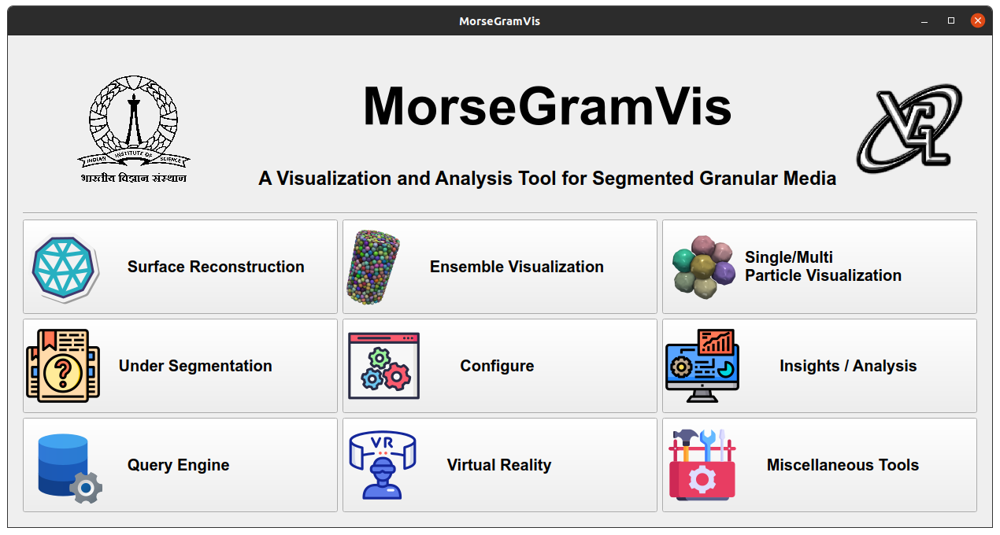
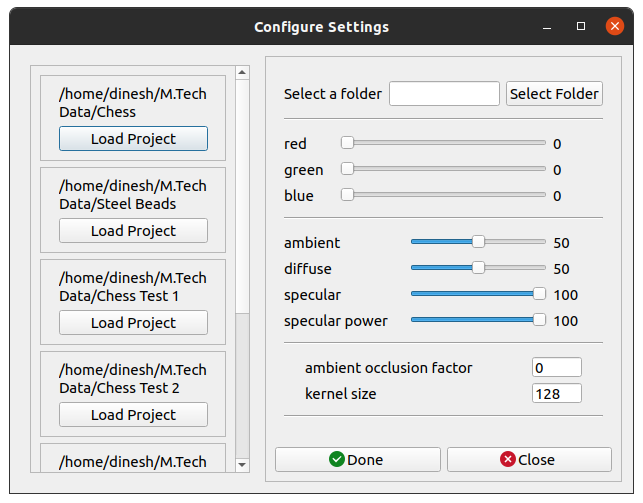
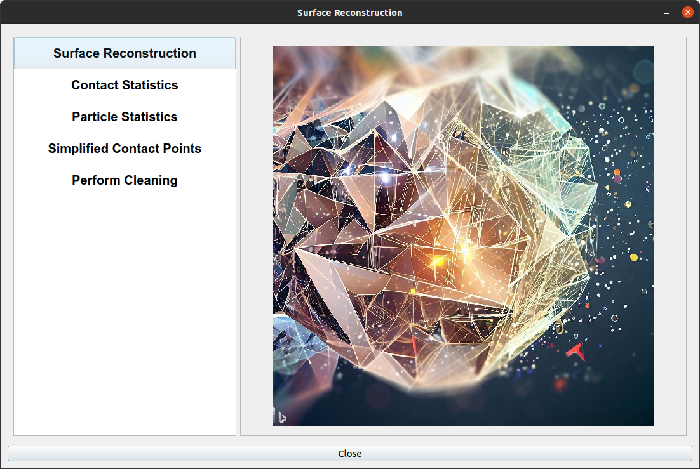
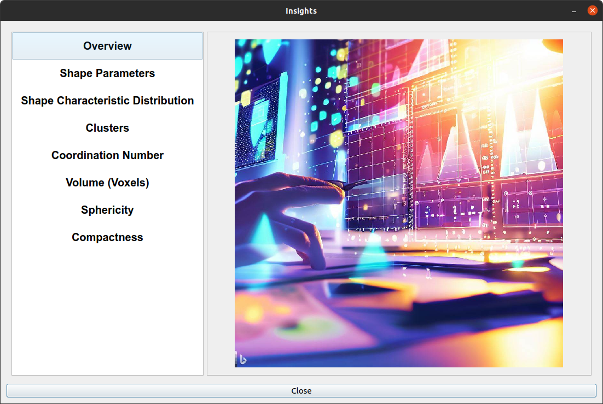
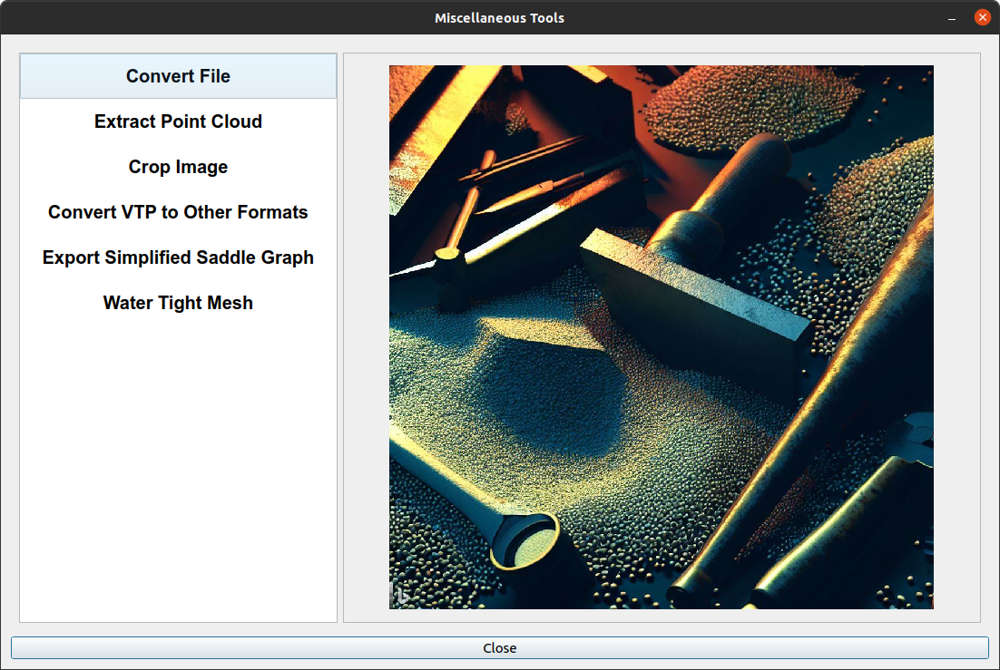

# MorseGramVis - A Visualization and Analysis Tool for Segmented Granular Media

## Description
Visualization and Analysis tool for MorseGram.

## UI

**Figure 1: Start Window**



**Figure 2: Configure Window**



**Figure 3: Surface Reconstruction Window**



**Figure 4: Insights Window**



**Figure 5: Miscellaneous Tools Window**



## Prerequisites
- Python 3.8 or higher

## Installation

1. Clone the repository:
   ```sh
   git clone <repo-url>
   cd morsegramvis
   ```
2. (Recommended) Create a virtual environment:
   ```sh
   python -m venv venv
   source venv/bin/activate  # On Windows use: venv\Scripts\activate
   ```
3. Install all dependencies:
   ```sh
   pip install -r requirements.txt
   ```
4. (Optional) Install the project as a package (for easy imports and CLI):
   ```sh
   pip install -e .
   ```

## Quick Start

After installation, you can launch the application with:
```sh
python start.py
```
Or, if installed as a package:
```sh
morsegramvis
```

## Usage

1. Make sure the virtual environment is activated.
2. Run the project: `python start.py`

## Getting Started with Visualization

**Task: Surface Reconstruction**

Follow the steps below to perform visualization:

1. Choose the dataset you want to work with by accessing the configure window (refer to Figure 2).
2. Select the folder containing the dataset and adjust the parameters as needed.
3. Open the surface reconstruction window (refer to Figure 3).
4. From the navigation options, choose the surface reconstruction option.
5. Click the start button to begin the surface reconstruction process.
6. Once the surface reconstruction is completed, click the merge button.
7. After merging all the surface meshes, the ensemble is created.
8. Close the surface reconstruction window.
9. Finally, open the ensemble visualization window to view and analyze the ensemble or open the single/multi-particle visualization window to view and analyze at the particle level.

These steps will guide you through the process of performing ensemble visualization using the tool.

## Getting rid of erroneous particles

To perform cleaning and remove erroneous particles, please follow these steps:

1. Open the Surface Reconstruction window (refer to the [UI screenshot](assets/ui_sr.png)).
2. From the navigation options on the left side of the window, select "Perform Cleaning."
3. Wait for the cleaning process to finish. This process may take some time, depending on the size and complexity of the dataset.
4. Once the cleaning process is complete, a volume histogram will be displayed. Please take note of the volume threshold or cutoff value and its units. All particles with a volume (measured in the number of voxels/points in the point cloud) less than the chosen cutoff are considered erroneous particles.
5. Provide the volume cutoff value in the input field present in the cleaning window.
6. Start the cleaning process by pressing the designated button.
7. Wait for the cleaning process to finish execution.
8. After the process is finished, all erroneous particle IDs are stored in the "data/clean_data.pkl" file.
9. A new button will be enabled, indicating the option to create a clean and new ensemble file. Press this button to generate a new ensemble file that is free from erroneous particles.

By following these steps, you will successfully perform cleaning and remove erroneous particles from the dataset, ensuring a more accurate and reliable analysis.

## Getting Started with Query Engine

**Steps to Follow:**

1. Ensure that you have performed the surface reconstruction task for all particles in the dataset.
2. Once the project is configured, open the surface reconstruction window (refer to [UI image](assets/ui_sr.png)).
3. From the navigation options on the left, select "Particle Statistics".
4. Check the "Noisy Particle" checkbox to compute statistics for all particles, including noisy ones. If you want to ignore noisy particles, leave the checkbox unchecked. Then, click on the "Compute Particle Statistics" button.
5. Wait for the computation process to complete.
6. After the computation is finished, close the surface reconstruction window.
7. Finally, open the Query Engine window by accessing the start window.

By following these steps, you will ensure that the surface reconstruction is performed for all particles in the dataset. You can then proceed to compute particle statistics. Once the computation is complete, you can close the surface reconstruction window and open the Query Engine window for further analysis and exploration of the data.

## Getting Started with Insights / Analysis

Please follow these steps:

1. Ensure that the previous task Query Engine is complete.
2. Open the Surface Reconstruction window ([UI image](/assets/ui_sr.png)).
3. From the navigation options on the left side of the window, select "Contact Statistics."
4. Wait for the process to finish, as it may take some time depending on the size of the dataset.
5. Once the surface reconstruction process is complete, close the Surface Reconstruction window.
6. Open the Insights/Analysis window.
7. In the Insights/Analysis window, you will find various plots and information related to the dataset based on the option chosen from the navigation options.

By exploring the different navigation options in the Insights/Analysis window, you can access valuable insights and analysis of the granular material dataset.

## Visualization of Contact Region

Here are the steps to follow:

1. Ensure that you have performed the surface reconstruction task for all the particles in the dataset.

2. After configuring the project, open the surface reconstruction window [UI image](assets/ui_sr.png).

3. Choose "Contact Statistics" in the navigation options on the left, then click the "Compute Contact Statistics" button.

4. Wait until the computation ends.

5. Finally, after finishing the computation, close the surface reconstruction window.

6. Now, the contact region visualization feature should be available for use.

By following these steps, you can ensure that the surface reconstruction is performed for all particles in the dataset. After configuring the project and opening the surface reconstruction window, choose "Contact Statistics" to compute the contact statistics. Once the computation is complete, close the surface reconstruction window. With the contact region visualization feature now enabled, you can proceed with visualizing and analyzing the contact regions in the granular material.

## Update Environment Parameters like Background Color and Lighting Conditions

The following instructions outline a three-step process for adjusting the environment parameters through a setting dialog:

1. Click on the "gear" icon located in the toolbar of the ensemble/single visualization window.

2. The setting dialog will open, displaying various options and widgets to adjust the environment parameters. Use the appropriate widgets to make the desired adjustments.

3. After making the necessary changes, close the setting dialog to apply the adjusted environment parameters.

By following these steps, users can easily access and modify the environment parameters, including background color and lighting conditions, through the setting dialog.

## Computing Simplified Saddle Graph

Here is a set of instructions to compute a simplified saddle graph:

1. Ensure that the surface reconstruction task for all particles is complete.
2. Open the surface reconstruction window and navigate to the options menu.
3. Choose the "Simplified Saddle Graph" option from the navigation menu.
4. Click on the "Start" button to initiate the computation process.
5. Wait for the process to finish, as it may take some time depending on the complexity of the data.
6. Once the process is complete, close the surface reconstruction window.
7. Open the single/multi-particle visualization window.
8. In the toolbar, locate and select the "Show Simplified Saddle" icon.

Following these instructions will allow users to compute and visualize the simplified saddle graph for the surface reconstruction.

## Manually Labelling Particles

To manually label particles, follow these steps:

1. Ensure that the surface reconstruction task is complete.
2. Open the single/multi-particle visualization window.
3. By default, you will see an orange-colored sand particle icon in the toolbar, indicating that the particle is not labeled.
4. Press the "c" key to label the particle as correctly segmented. The color of the icon discussed in the previous instruction will change to green.
5. Press the "i" key to label the particle as not correctly segmented. The color of the sand particle icon in the toolbar will change to red.
6. All the label information will be stored in a pickle file located in the project folder under "data/labels.pkl".

By following these steps, you can create labeled particles, where the labels indicate whether the particles are correctly segmented or not. The pickle file will contain the necessary label information for further analysis.

## Creating dataset for learning undersegmented particles

To create a dataset for learning undersegmented particles, follow these steps:

1. Ensure that you have completed labeling of particles.
2. Open the miscellaneous tools window (refer to [UI image](assets/ui_mt.png)) and select the "export simplified saddle graph" option from the navigation menu.
3. Depending on the type of classification model you are using, choose the folder containing the mesh or saddle graph.
4. Provide the location of the pickle file that contains the information on the labels of the particles.
5. Specify the target location for storing the correctly labeled particles and the not correctly labeled particles.
6. Click the "export" button to start the export process.
7. Wait for the process to finish. The dataset containing the undersegmented particles, along with their corresponding labels, will be saved in the specified target locations.

By following these steps, you will generate a dataset that can be used for training a classification model to identify undersegmented particles. The dataset will consist of the particles, their associated features (from the mesh or saddle graph), and their labels indicating whether they are correctly segmented or not.

## Training Models for learning undersegmented particles

To train the Graph Neural Network (GNN) using the dataset generated from the previous steps, follow these instructions:

1. Make sure that you have completed the previous task of creating a dataset for learning undersegmented particles.
2. Run the appropriate classification model implemented in the Jupyter notebook. Locate the notebook file in the "notebooks" folder of the software source code repository.
3. Ensure that the preprocessed data is stored in the "notebook/data/preprocessed" directory or the appropriate location specified by the notebook.
4. Start the training process by executing the notebook cells. The model will begin training on the preprocessed dataset.
5. Wait for the training process to complete. This may take some time depending on the complexity of the model and the size of the dataset.

During the training process, the GNN model will learn to classify undersegmented particles based on the provided features and labels. The duration of training will vary depending on the specific model architecture and the computational resources available. Once the training is finished, you can evaluate the performance of the trained model on test data or use it for predictions on new, unseen data.

## Project Structure

- `core/` - Core logic and algorithms
- `ui/` - User interface components
- `colormap/` - Colormap resources
- `assets/` - UI images and icons
- `Notebooks/` - Jupyter notebooks for analysis and model training
- `start.py` - Main entry point for the application
- `requirements.txt` - List of dependencies
- `setup.py` - Installation script

## Development & Contribution

1. Fork the repository and create a new branch.
2. Make your changes and commit them.
3. Push to your fork and open a pull request.

## License
Specify your license here (e.g., MIT, GPL, etc.)

## Contact

For any inquiries or support regarding this project, please feel free to reach out to us:

**Rathod Dinesh**

- Email: rathoddinesh@iisc.ac.in

**Vijay Natarajan**

- Email: vijayn@iisc.ac.in

We will be happy to assist you!

<!-- citation -->

## References:

1. https://www.vtk.org
2. https://p.yusukekamiyamane.com/
3. https://icons8.com/icons
4. https://sciviscolor.org/colormaps/
5. https://blog.streamlit.io/auto-generate-a-dataframe-filtering-ui-in-streamlit-with-filter_dataframe/
